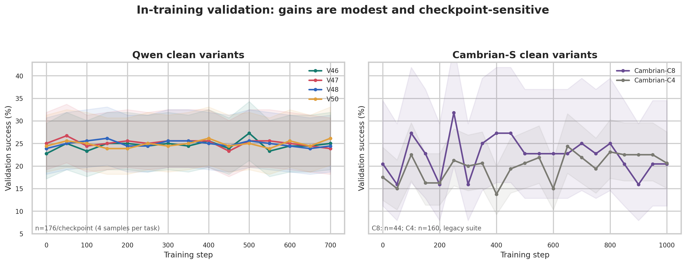
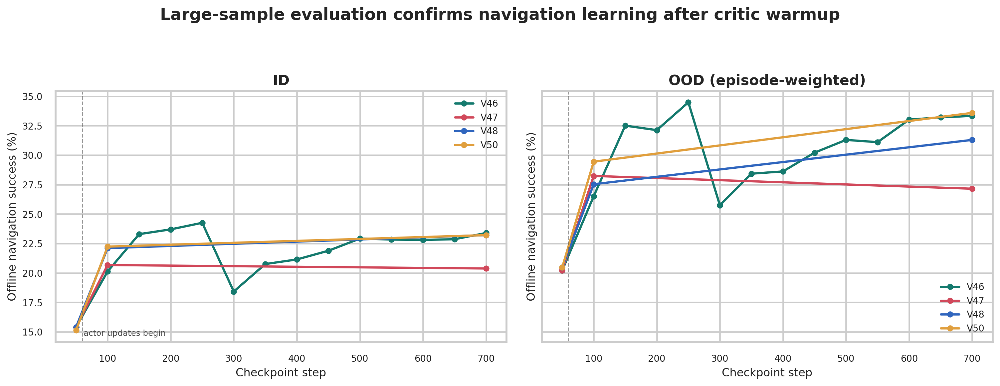
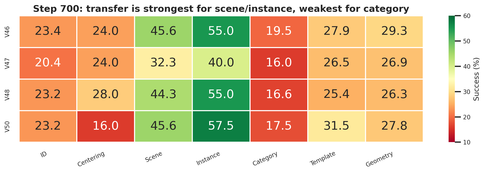
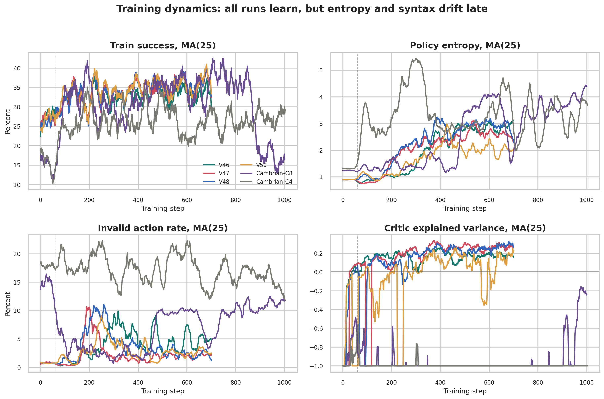
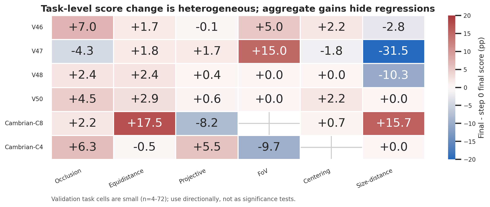
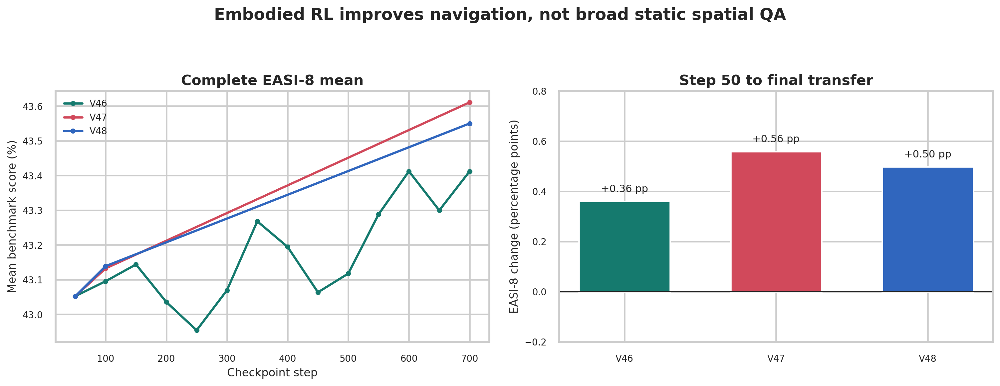

# Active Spatial V46-V50 与 Cambrian-S 完整分析

生成日期：2026-09-06  
数据源：`/mnt/umm/users/yinbaiqiao/VAGEN-Lite`  
口径：只把 D0 old-logprob 修复后的 clean runs 作为训练结论；V49 单独标为无效。

## 一页结论

1. **训练确实学到了导航，但收益不大且不稳定。** 大样本离线评测中，Qwen 四版从 step 50 的 ID 约 15% 提升到 step 700 的 20%-23%，OOD 从约 20% 提升到 27%-34%。
2. **V47 的更强 KL=0.40 没有带来稳定性红利，反而是最弱终点。** step 700 ID 为 20.4%，明显低于 V46/V48/V50 的约 23.2%-23.4%；OOD 也只有 27.2%。
3. **W1 与 W3 没有形成清晰胜负。** V48-W1 与 V46-W3 的 step 700 ID 基本相同；V46 的中期峰值更强，但曲线在 step 300 明显回撤。单次 run 不足以支持“W3 必然更好”。
4. **V50 改善的是鲁棒性轮廓，不是总体 ID 上限。** 低 entropy、短 response 和微小 format reward 使最终 validation 格式最干净；离线 OOD 33.6% 为四版最高，但只比 V46 高 0.3pp，不能视为显著领先。
5. **真正的泛化瓶颈是 task semantics。** 所有模型在 scene/instance OOD 上明显更强，在 category OOD 上只有约 16%-20%。聚合 OOD 高于 ID 主要来自 suite 难度构成，不能解释成“模型在 OOD 上反而泛化更好”。
6. **RL 学到的是交互策略，不是通用静态空间能力。** 完整 EASI-8 上，V46/V47/V48 从 step 50 到最终仅变化约 0.4-0.6pp，几乎持平；与 navigation 的 8-13pp 增长形成鲜明对照。
7. **Cambrian-C8 有早期窗口，但后期退化。** 内部 validation 在 step 250 达到 31.8%，step 1000 回到 20.5%；末 50 步训练 entropy 约 4.10、invalid action 约 11.3%，不应直接使用 final checkpoint。
8. **Cambrian-C4 的高方差 reward bundle 更差。** validation 从 17.5% 到峰值 24.4%，且最终 invalid action 22.5%。C8 的 reward scaling + action-valid bundle 明显改善格式，但仍未解决后期 policy drift。

## 实验定义

| 版本 | 核心变量 | 有效性 |
| --- | --- | --- |
| V46 | Qwen-7B, W3, KL=0.30, entropy=0.005 | clean，有效，700 steps |
| V47 | V46 + KL 0.30 -> 0.40 | clean，有效，700 steps |
| V48 | V46 + window 3 -> 1 | clean，有效，700 steps |
| V49 | 复现 V26：W1, KL=0.20, legacy 7-type/OOD | **无效：bad renderer，仅 step 0** |
| V50 | V46 + entropy=0.001, response 384 -> 160, format reward=0.01 | clean，有效，700 steps |
| Cambrian-C8 | scaled reward + action-valid, deterministic validation | clean，有效，1000 steps |
| Cambrian-C4 | success reward=50, weaker shaping/action-valid, stochastic validation | clean，有效，1000 steps；与 C8 不是单因素对照 |

## 训练内验证

| 模型 | Step 0 | Peak | Final | Final invalid |
| --- | ---: | ---: | ---: | ---: |
| V46 | 22.7% | 27.3% @ 500 | 25.0% | 7.4% |
| V47 | 25.0% | 26.7% @ 50 | 23.9% | 3.4% |
| V48 | 23.9% | 26.1% @ 150 | 24.4% | 4.5% |
| V50 | 24.4% | 26.1% @ 400 | 26.1% | 0.0% |
| Cambrian-C8 | 20.5% | 31.8% @ 250 | 20.5% | 0.0% |
| Cambrian-C4 | 17.5% | 24.4% @ 650 | 20.6% | 22.5% |

训练内 validation 的 Qwen 每点 n=176；Cambrian-C8 每点仅 n=44，置信区间更宽；Cambrian-C4 使用 legacy suite，不能直接按绝对值与 C8 排名。峰值是探索性 checkpoint selection，不能当作无偏估计。



## 大样本离线导航

Step 700 统一评测：

| 模型 | ID success | OOD weighted success |
| --- | ---: | ---: |
| V46 | 23.4% | 33.3% |
| V47 | 20.4% | 27.2% |
| V48 | 23.2% | 31.3% |
| V50 | 23.2% | 33.6% |





V46 的全 checkpoint sweep 显示最佳 ID 是 step 250（24.3%），随后 step 300 掉到 18.4%，再逐步恢复。这个非单调性说明训练步数本身不是可靠 model-selection 规则，必须保留并评测中间 checkpoint。

## 训练稳定性



- 所有 run 在 critic warmup=60 前 actor 都不更新，因此 step 50 近似共同 pretrained anchor；真正的版本差异应从 step 100 后判断。
- Qwen 后期 train success 仍高于 validation，但 entropy 和 invalid action 同时上升，存在 train-distribution overfit / sampling drift。
- Cambrian 的 critic explained variance 大量时间接近或低于 0，特别是高方差 C4；value model 对 return 的解释能力不足。
- rollout IS 的 ESS/N 长期接近 1，说明 D0 修复后的 runtime correction 本身不是这些曲线退化的主要原因。

## 任务与能力迁移





任务级结果不支持“整体空间能力统一提升”：同一 checkpoint 往往在 projective/instance 类任务上提升，却在 occlusion、centering 或 category 上持平甚至回退。建议后续将 reward 与 validation 都改成按 task type 平衡，而不是只追总体 success。

## 数据完整性与不能下的结论

- V49 没有有效训练，不能补点、插值或与 V46-V50 连线。
- Cambrian-C8/C4 的恢复后离线 navigation 文件仍是 `missing`，因此不能宣称 Cambrian 优于或弱于 Qwen 的大样本 ID/OOD 表现。
- V50 最新 EASI 文件只含 3DSRBench 和 EmbSpatial 两项，不是 EASI-8；静态 QA 主结论只使用 V46/V47/V48 的完整 8 项结果。
- 目前每个 recipe 只有一个 seed。小于约 1pp 的版本差异不应包装成确定性结论。
- C4 与 C8 同时改变 reward scale、potential scale、format penalty、rollout 数和 validation sampling，不能把差异归因于单一超参。

## 组会建议主线

1. 先交代 D0 clean restart，历史旧 run 只作背景，不作方法证据。
2. 用图 02 证明“RL 有效”：critic warmup 后 navigation 明显上升。
3. 用图 03 说明“提升不均匀”：instance/scene 强，category 弱。
4. 用图 06 给出最重要 insight：交互导航能力提升，但静态空间 QA 几乎不动。
5. 用图 04 收束到下一步：需要 task-balanced reward、早停/中间 checkpoint 选择，以及 Cambrian 外部 eval 补齐，而不是继续单纯延长训练。

## 可复现方式

```bash
/mnt/umm/users/yinbaiqiao/.conda/envs/probe-spatial/bin/python \
  scripts/analyze_active_spatial_training.py
```

机器可读表位于本目录 `tables/`；图同时提供 PNG 和 PDF。
